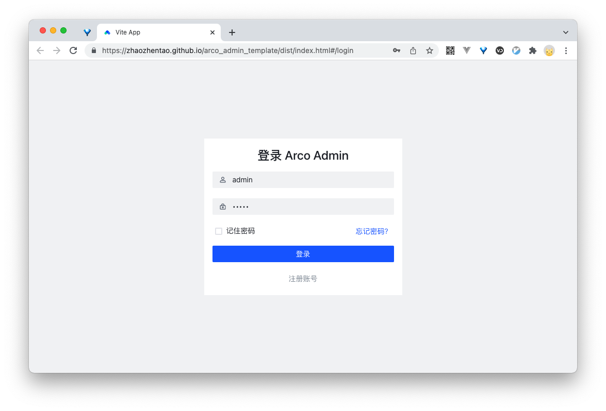
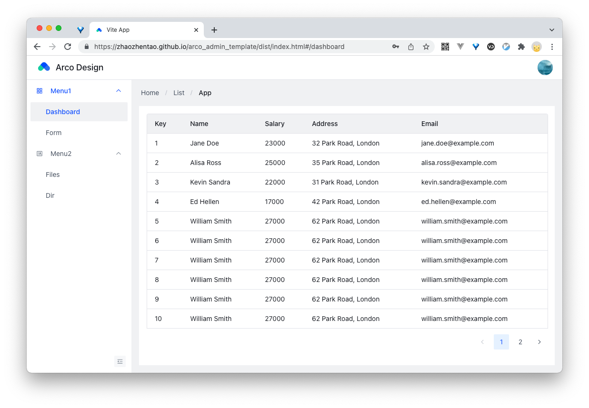

# arco-admin-template

## Build Setup

```bash
# clone project
git clone https://github.com/zhaozhentao/arco_admin_template.git

# enter the project directory
cd arco-admin-template

# install dependency
npm install

# develop
npm run dev
```

## Build
```bash
npm run build
```

## Preview

### [online preview](https://zhaozhentao.github.io/arco_admin_template/dist/index.html#/)




## Related Project

- [arco-design](https://arco.design/)
- [vue-admin-template](https://github.com/PanJiaChen/vue-admin-template/)
